# not-a-hat
A Python application for handling CFG grammars according to the Backus-Naur Form.

This project uses Poetry as its main dependency manager. For installing it, you may use

```shell
make install-poetry
```

After the installation, ask Poetry to install the project dependencies
by using

```shell
make install
```

A classic `make run` can be used for running the code. Right now,
this project handles only the lexical analysis part. Inside
its `main` module, you can find all the token patterns and their
regexes according to the `resources/grammar.txt`.

The symbol tables for the respective test codes will be put
inside `output/`, at last.

# State Diagrams

## Plus


## Minus

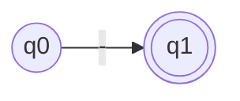

## Times

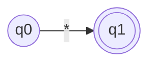

## Divide

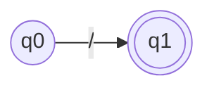

## Mod

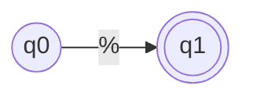

## Less than


## Greater than


## Less or Equals than

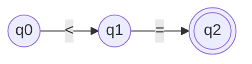

## Greater or Equals than


## Equality


## Inequality

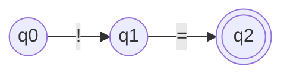

## ID

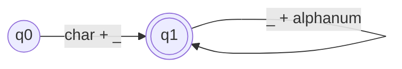

## Assign (equals)

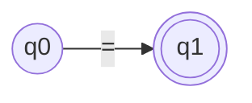

## Comma

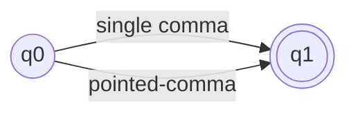

## Left bracket

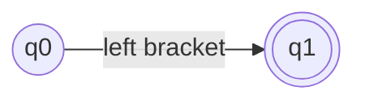

## Right bracket

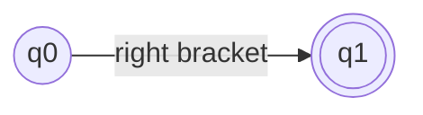

## Left parenthesis

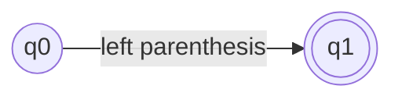

## Right parenthesis

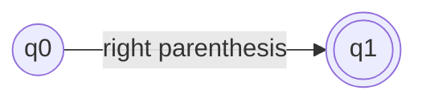

## Left square bracket

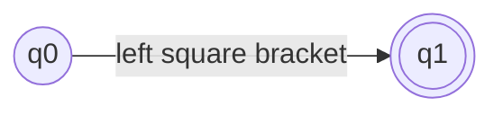

## Right square bracket

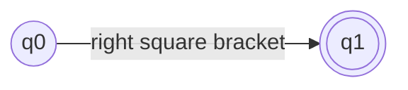

## String literals

```mermaid
flowchart LR
    q0((q0))
    q1((q1))
    q2(((q2)))

    q0-->|quote|q1
    q1-->|any text|q1
    q1-->|quote|q2
```

## Integer literals

```mermaid
flowchart LR
    q0((q0))
    q1(((q1)))

    q0-->|number|q1
    q1-->|number|q1
```

## Float literals

```mermaid
flowchart LR
    q0((q0))
    q1((q1))
    q2(((q2)))

    q0-->|number|q1
    q1-->|number|q1
    q1-->|.|q2
    q2-->|number|q2
```

## if

```mermaid
flowchart LR
    q0((q0))
    q1((q1))
    q2(((q2)))

    q0-->|i|q1
    q1-->|f|q2
```

## else

```mermaid
flowchart LR
    q0((q0))
    q1((q1))
    q2((q2))
    q3((q3))
    q4(((q4)))

    q0-->|e|q1
    q1-->|l|q2
    q2-->|s|q3
    q3-->|e|q4
```

## for

```mermaid
flowchart LR
    q0((q0))
    q1((q1))
    q2((q2))
    q3(((q3)))

    q0-->|f|q1
    q1-->|o|q2
    q2-->|r|q3
```

## while

```mermaid
flowchart LR
    q0((q0))
    q1((q1))
    q2((q2))
    q3((q3))
    q4((q4))
    q5(((q5)))

    q0-->|w|q1
    q1-->|h|q2
    q2-->|i|q3
    q3-->|l|q4
    q4-->|e|q5
```

## def

```mermaid
flowchart LR
    q0((q0))
    q1((q1))
    q2((q2))
    q3(((q3)))

    q0-->|d|q1
    q1-->|e|q2
    q2-->|f|q3
```

## ident

```mermaid
flowchart LR
    q0((q0))
    q1((q1))
    q2((q2))
    q3((q3))
    q4((q4))
    q5(((q5)))

    q0-->|i|q1
    q1-->|d|q2
    q2-->|e|q3
    q3-->|n|q4
    q4-->|t|q5
```

## new

```mermaid
flowchart LR
    q0((q0))
    q1((q1))
    q2((q2))
    q3(((q3)))

    q0-->|n|q1
    q1-->|e|q2
    q2-->|w|q3
```

## constant

```mermaid
flowchart LR
    q0((q0))
    q1((q1))
    q2((q2))
    q3((q3))
    q4((q4))
    q5(((q5)))

    q0-->|c|q1
    q1-->|o|q2
    q2-->|n|q3
    q3-->|s|q4
    q4-->|t|q5
```

## null

```mermaid
flowchart LR
    q0((q0))
    q1((q1))
    q2((q2))
    q3((q3))
    q4(((q4)))

    q0-->|n|q1
    q1-->|u|q2
    q2-->|l|q3
    q3-->|l|q4
```

## string

```mermaid
flowchart LR
    q0((q0))
    q1((q1))
    q2((q2))
    q3((q3))
    q4((q4))
    q5((q5))
    q6(((q6)))

    q0-->|s|q1
    q1-->|t|q2
    q2-->|r|q3
    q3-->|i|q4
    q4-->|n|q5
    q5-->|g|q6
```

## break

```mermaid
flowchart LR
    q0((q0))
    q1((q1))
    q2((q2))
    q3((q3))
    q4((q4))
    q5(((q5)))

    q0-->|b|q1
    q1-->|r|q2
    q2-->|e|q3
    q3-->|a|q4
    q4-->|k|q5
```

## return

```mermaid
flowchart LR
    q0((q0))
    q1((q1))
    q2((q2))
    q3((q3))
    q4((q4))
    q5((q5))
    q6(((q6)))

    q0-->|r|q1
    q1-->|e|q2
    q2-->|t|q3
    q3-->|u|q4
    q4-->|r|q5
    q5-->|n|q6
```

## print

```mermaid
flowchart LR
    q0((q0))
    q1((q1))
    q2((q2))
    q3((q3))
    q4((q4))
    q5(((q5)))

    q0-->|p|q1
    q1-->|r|q2
    q2-->|i|q3
    q3-->|n|q4
    q4-->|t|q5
```